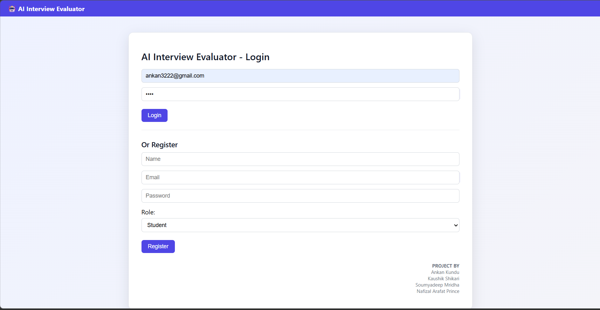
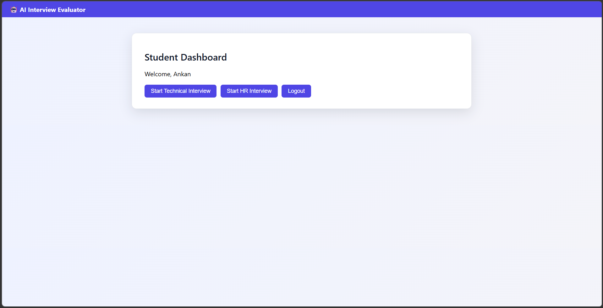
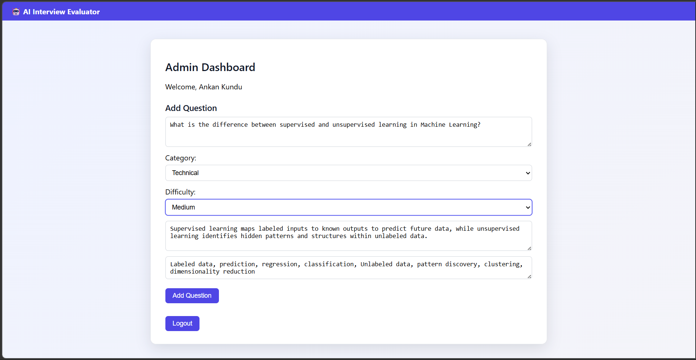
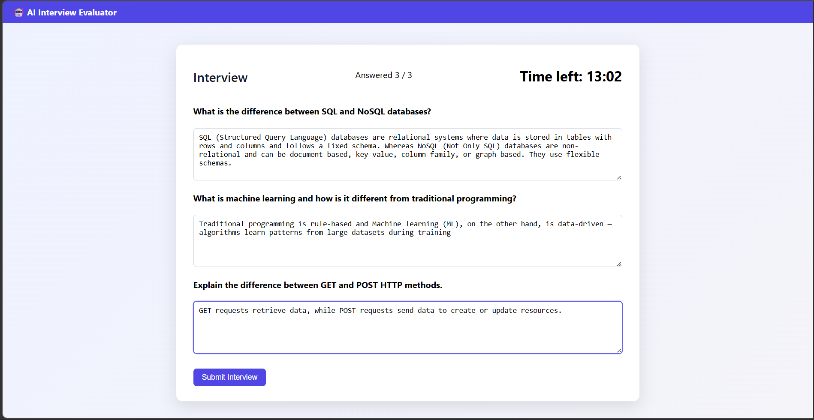
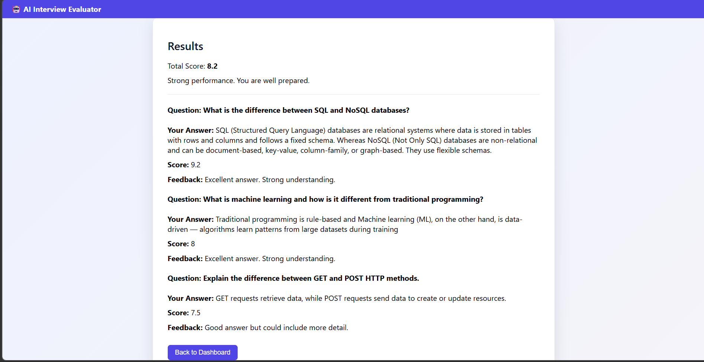

# AI Interview Evaluator

A full-stack web application that simulates interview environments and evaluates candidate responses using natural language processing techniques.

## Overview

This project is designed to help students practice interview questions and receive structured feedback on their answers. It combines a web-based interface with an AI-driven evaluation system to simulate both HR and technical interview scenarios.

The system focuses on analyzing textual responses and providing meaningful feedback based on semantic understanding and key concept coverage.

## Key Features

* User authentication (student login & registration)
* Admin panel for managing interview questions
* HR and Technical interview modes
* Real-time answer evaluation
* Hybrid scoring system (semantic + keyword-based)
* Interview timer with auto-submit
* Automatic feedback generation
* SQLite-based data storage

## Tech Stack

**Frontend**

* React
* Axios

**Backend**

* Flask
* SQLAlchemy
* Flask-CORS

**AI / NLP**

* Sentence Transformers
* Pretrained model: `all-MiniLM-L6-v2`

**Database**

* PostgreSQL (Supabase)

## System Architecture

The application follows a client-server architecture:

* React frontend handles user interaction
* Flask backend manages APIs and evaluation logic
* NLP module processes and evaluates responses
* SQLite database stores users, questions, and results

## How the Evaluation Works

The system uses a hybrid approach to evaluate answers:

1. **Semantic Similarity**

   * Compares user response with a reference answer using Sentence Transformers

2. **Keyword Matching**

   * Ensures key concepts are present in the answer

3. **Length Consideration**

   * Encourages sufficiently detailed responses

**Final Score Calculation:**

```id="scorecalc"
Score = 0.8 × Semantic Score + 0.2 × Keyword Score + Length Bonus
```

The final score is mapped to feedback categories to guide improvement.

## Workflow

1. User Login / Select Interview Mode
2. Question Display (Frontend - React)
3. User Submits Answer
4. API Request to Backend (Flask)
5. Answer Processing

   ├── Semantic Similarity (Sentence Transformers)

   ├── Keyword Matching

   └── Length Evaluation
   
7. Hybrid Score Calculation
8. Feedback Generation
9. Response Sent to Frontend
10. Score & Feedback Displayed to User

## Project Structure

```id="projstruct"
AI-Interview-Evaluator
│
├── backend
│   ├── app.py
│   ├── ai_evaluator.py
│   └── requirements.txt 
│
├── frontend
│   ├── src
│   ├── public
│   └── package.json
│
└── README.md
```

## Setup Instructions

### Backend

```id="backendsetup"
cd backend
python -m venv venv
venv\Scripts\activate
pip install -r requirements.txt
python app.py
```

### Frontend

```id="frontendsetup"
cd frontend
npm install
npm start
```

## Note

On first run, the Sentence Transformer model (`all-MiniLM-L6-v2`) will be downloaded (~90MB).

## Limitations & Future Work

* Evaluation is based on similarity, not full contextual understanding
* Limited dataset of questions
* Future improvements:

  * Interview performance tracking
  * Analytics dashboard
  * More advanced NLP models
  * Personalized feedback generation

## Demo

## Demo

### Application Screenshots

#### Login Interface
Users can log in as either a **Student** or an **Admin** based on their role.



---

#### Student Dashboard
Students can access interview modes and start answering questions in a structured environment.



---

#### Admin Panel
Admins can manage and update interview questions for both HR and technical rounds.



---

#### Answer Submission
Users can write and submit their responses within the given time during the interview session.



---

#### Evaluation & Feedback
The system evaluates responses using a hybrid AI approach and provides scores along with feedback.



## Contributors

* Ankan Kundu
* Kaushik Shikari
* Soumyadeep Mridha
* Nafizal Arafat Prince
